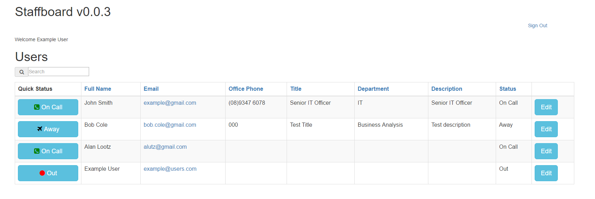

# staffboard
A real time status and contact page with live updates using MEAN + socket.io

## Purpose of staffboard
An In/Out/Status page for users using socket.io for live updates to status of connected users

### This project requires
MongoDB installed and running
Node installed

### To install/setup 
Download the zip file

Extract the zip file contents 

In a command prompt browse to the root of the folder run 
In a command prompt browse to the root of the folder 

by default it will display on localhost port 3000
